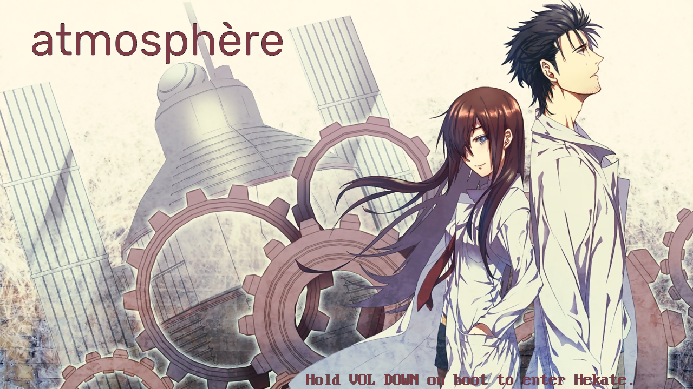

# Simple Switch Custom Bootlogo Tutorial #
By [Hurlzzz](https://github.com/Hurlzzz "To my profile")

## Summary and Target Audience ##
If you want a little personal touch on your Nintendo Switch every time it boots up, this is the tutorial for you! With a custom bootlogo, you can turn *any* 1280x720p image into the boot screen of your Nintendo Switch. Since a "hacked" switch is required for this tutorial, it will be assumed you already have the basic computer knowledge necessary. If you are looking for a guide on how to hack your switch, go [Here](https://switch.homebrew.guide/).

## Requirements ##
- "Hacked" Nintendo Switch running [Atmosphere](https://github.com/Atmosphere-NX/Atmosphere/releases) Custom Firmware (Any Version)
- An image with EXACT resolution of 1280x720p you wish to use as your bootscreen
- Basic Image editing Software
- Simple Text Editor

## Tutorial ##

1. With your 1280x720p image, rotate it 90 degrees *counter-clockwise* to match the Switch's default orientation.
2. Using a free image converter such as [This](https://online-converting.com/image/convert2bmp/), convert your image to a .BMP file
    - When converting, you must select 32-bit ARGB or it will not be compatible with your Switch
3. Rename your image to exactly `bootlogo.bmp` or it will not be compatible with your Switch
4. Move your completed `bootlogo.bmp` to the root of your SD card for your Switch.
5. Browse your SD card for `/bootloader/hekate_ipl.ini` and open `hekate._ipl.ini` with your text editor.
6. Directly Underneath `[Atmosphere]` add the line `logopath=/bootlogo.bmp`
7. You're all done! Just boot your switch and enjoy your custom logo as it boots up.

